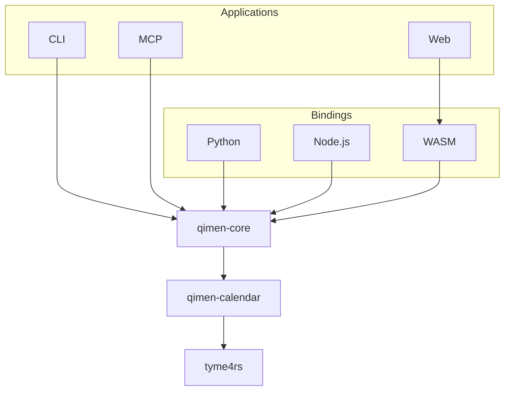

# qimen-rs

[简体中文](README.md) · [Web charts](apps/web/README.md) · [Installation](docs/installation.md) · [Usage](docs/usage.md) · [Calculation rules](docs/algorithm-sources.md) · [Annotations](docs/extensions.md)

A Rust library for Four Pillars (BaZi) and Qimen Dunjia charts from Gregorian dates and civil times. The default method uses **hour-based Qimen, Chai Bu (拆补), rotating plates (转盘), fixed center-to-Kun hosting, and Tian Qin accompanying Tian Rui**.

Calculations work offline. Rust, Python, Node.js, WebAssembly, Web, CLI and MCP share the same chart engine and result format.

- **Calendar and BaZi:** lunar dates, Four Pillars, solar-term instants and configurable day boundaries.
- **Complete base charts:** Dun, Yuan, Ju, xun head, duty star and door, nine palaces, voids and the hour horse.
- **Optional annotations:** hidden stems, strength, twelve growth stages, six-instrument punishment, tombs, the day horse and door pressure.
- **Multiple interfaces:** Rust types, JSON, Python dictionaries, JavaScript objects, terminal output and MCP tools.
- **Visual charts:** a celestial mountain landscape, palace details, two-hour navigation, sharing and exports on desktop and mobile.

This guide describes the **0.2.0 API**. Streamable HTTP and the extended date range require **0.2.0+**; check your installed version before using them, or build from source. Rust crates and language packages share the project version. JSON Schema has its own version for data-format compatibility.

## Installation and quick start

Download an archive for your system from [GitHub Releases](https://github.com/SpenserCai/qimen-rs/releases) and extract `qimen` and `qimen-mcp`. Alternatively, install the stable applications with Cargo:

```bash
cargo install qimen-cli --locked
cargo install qimen-mcp --locked
```

```bash
qimen paipan --year 2026 --month 9 --day 18 --hour 15
qimen paipan --year 2026 --month 9 --day 18 --hour 15 --json
qimen bazi --year 2026 --month 9 --day 18 --hour 15
```

Minutes and seconds default to zero, the fixed UTC offset to +480 minutes (UTC+08:00), and the day boundary to 23:00. Input represents civil time at the supplied offset; the machine's time zone is not read.

| Interface | Install | Guide |
| --- | --- | --- |
| Rust | `cargo add qimen-core` | [Rust API](https://docs.rs/qimen-core/latest/qimen_core/) |
| Python 3.10+ | `python -m pip install qimen-rs` | [Python](bindings/python/README.md) |
| Node.js 20+ | `npm install @spensercai/qimen-rs` | [Node.js / TypeScript](bindings/node/README.md) |
| Browser WASM | `npm install @spensercai/qimen-wasm` | [WebAssembly](bindings/wasm/README.md) |

Prebuilt native packages cover Linux x64 / arm64, macOS x64 / arm64 and Windows x64. See [installation](docs/installation.md) for system requirements and source builds.

### Web charts

`apps/web` is a ready-to-use visual application. Enter a Gregorian date, local time and UTC offset to reveal the Four Pillars and nine-palace chart after a brief compass animation. Select a palace to inspect its plates, stars, doors, deities and optional annotations. Calculations run in the browser through WASM.

Start locally with Node.js 22+:

```bash
cd apps/web
npm ci
npm run dev
```

Open [localhost:3000](http://localhost:3000). See the [Web guide](apps/web/README.md) for controls and data handling.

### Rust

```rust
use qimen_core::{ChartRequest, calculate};

fn main() -> Result<(), qimen_core::Error> {
    let chart = calculate(&ChartRequest::new(2026, 9, 18, 15))?;
    println!("{}{}局", chart.dun, chart.ju);
    println!("{:?}", chart.calendar.four_pillars);
    Ok(())
}
```

### JSON

Python, JavaScript, the MCP chart tool and Rust's `calculate_json` accept the same request fields:

```json
{
  "year": 2026,
  "month": 9,
  "day": 18,
  "hour": 15,
  "minute": 0,
  "second": 0,
  "utc_offset_minutes": 480,
  "day_boundary": "zi_start"
}
```

Unknown fields, invalid dates and unsupported parameters produce explicit errors. See [usage](docs/usage.md), the [request schema](docs/schema/request.schema.json), [chart schema](docs/schema/chart.schema.json) and [complete output example](docs/examples/2026-09-18T150000+0800.json).

### Optional annotations

All annotations are disabled by default. Configure a reusable calculator or pass options to `calculate_with_options` for a single calculation:

```rust
use qimen_core::{Calculator, ChartRequest, DayHorseRule, ExtensionOptions};

fn main() -> Result<(), qimen_core::Error> {
    let calculator = Calculator::new(ExtensionOptions {
        day_horse: Some(DayHorseRule::DayBranchThreeHarmony),
        ..Default::default()
    });
    let chart = calculator.calculate(&ChartRequest::new(2026, 9, 18, 18))?;
    println!("{:?}", chart.extensions);
    Ok(())
}
```

`ExtensionOptions::all()` enables every implemented annotation. CLI users select them with arguments:

```bash
qimen paipan --year 2026 --month 9 --day 18 --hour 18 --extensions all
qimen paipan --year 2026 --month 9 --day 18 --hour 18 \
  --extensions hidden-stems,day-horse --json
```

Results appear under `chart.extensions`, with named rules, plate identity and hosted-stem origins. They do not change the base chart or hour horse. The field is omitted when disabled. These are common auxiliary concepts with school-specific formulas; see [annotation rules](docs/extensions.md).

### MCP

Running `qimen-mcp` starts the stdio service, exposing `bazi` and `paipan`. Example client configuration:

```json
{
  "mcpServers": {
    "qimen": {
      "command": "/absolute/path/to/qimen-mcp",
      "args": []
    }
  }
}
```

**Version 0.2.0+** supports Streamable HTTP. Run `qimen-mcp --transport streamable-http`, then connect to `http://127.0.0.1:8080/mcp`.

Replace `command` with the executable's absolute path. The official rmcp SDK handles the 2026-07-28 lifecycle and compatible legacy revisions. See the [MCP guide](docs/usage.md#mcp) for connections, tool arguments and results.

## Calculation conventions

| Topic | Convention |
| --- | --- |
| Date range | 0.1.0: years 1900–2100; 0.2.0+: proleptic Gregorian years 1–9999 CE |
| Time zone | Fixed UTC offset, default UTC+08:00; include applicable daylight-saving time |
| Year pillar | Changes at the start-of-spring instant, not Lunar New Year or January 1 |
| Month pillar | Changes at the twelve Jie instants, not Gregorian or lunar month boundaries |
| Day pillar | `zi_start` changes at 23:00; `midnight` changes at 00:00 |
| Late Zi hour | With `midnight`, 23:00 retains the current day pillar but uses the next day's hour stem, keeping Zi hour continuous |
| Day/hour clock | Supplied local civil time; no automatic apparent-solar-time correction |
| Dun | Yang from winter solstice, Yin from summer solstice, at the term instant |
| Yuan / Ju | Jia/Ji Fu Tou determines Yuan; the current solar term selects the Chai Bu Ju |
| Center / Tian Qin | Center hosted in Kun 2; Tian Qin accompanies Tian Rui; original center retained |
| Voids / horses | Hour xun voids and hour horse in the base chart; optional day horse separately |

Equivalent UTC-offset representations of the same instant produce the same year and month pillars; day and hour pillars follow the supplied local clock. Second-resolution solar-term fields describe output resolution, not guaranteed one-second astronomical accuracy across all dates.

Version 0.2.0+ uses the proleptic Gregorian calendar for historical dates. Adjacent solar terms may fall in year 0 or 10000, and early lunar dates may use year 0. The computational range does not imply modern astronomical accuracy for ancient or distant-future dates; see [date conventions](docs/usage.md#历史日期与远期日期).

Zhi Run, Mao Shan, flying plates and alternative hosting rules are not implemented. Match time, day-boundary, Ju-selection and hosting conventions when comparing charts. Full formulas appear in [calculation rules](docs/algorithm-sources.md).

## Results and structure

Results include the request and conventions, lunar date, Four Pillars, adjacent solar terms, Dun/Yuan/Ju, xun head and hidden instrument, duty star and door, and all nine Luo Shu palaces. Each palace carries direction, trigram, element, earth/heaven stems, hosted stems, stars, doors, deities, voids and horse markers. Center and Tian Qin hosting remain explicit.



Arrows show dependencies. `qimen-core` provides charts and annotations; `qimen-calendar` provides calendar data and Four Pillars. Applications and bindings share the result model. Prediction and interpretation are outside the base-chart data model.

Detailed guides are currently available in Chinese; this README provides the English overview and examples.

## License

[MIT](LICENSE). Calendar dependencies and references retain their own licenses; see [sources](docs/algorithm-sources.md).
