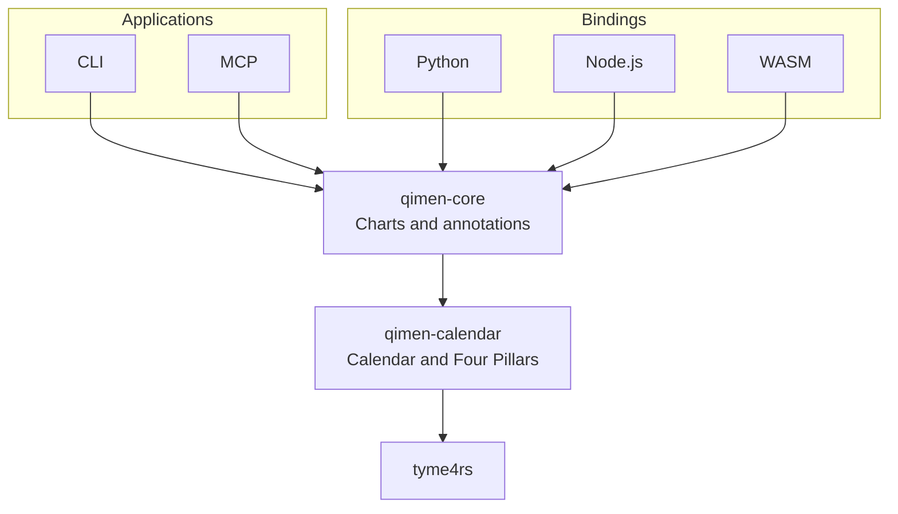

# qimen-rs

[简体中文](README.md) · [Algorithm sources](docs/algorithm-sources.md) · [Contributing](CONTRIBUTING.md) · [Releasing](docs/releasing.md)

A Rust library for Four Pillars (BaZi) and Qimen Dunjia charts from Gregorian dates and civil times. The default method uses **hour-based Qimen, Chai Bu (拆补), rotating plates (转盘), fixed center-to-Kun hosting, and Tian Qin accompanying Tian Rui**.

The computation is offline. CLI, MCP, Python, Node.js, and WebAssembly all call the same Rust libraries.

- **Calendar:** lunar dates, Four Pillars, solar-term instants and configurable day boundaries.
- **Base chart:** Dun, Yuan, Ju, duty star and door, nine palaces, voids and the hour horse.
- **Optional annotations:** hidden stems, strength, growth stages, punishments, tombs, the day horse and door pressure.
- **Interfaces:** typed Rust APIs, versioned JSON, language bindings, CLI and MCP.

## Architecture



Arrows point from callers to their dependencies.

| Component | Responsibility |
| --- | --- |
| `crates/qimen-calendar` | Validated dates, astronomical solar-term boundaries, lunar labels, Four Pillars; isolates tyme4rs |
| `crates/qimen-core` | Ju selection, plate rotation, typed versioned chart and JSON API |
| `bindings/python` | PyO3 / maturin, native dictionaries and JSON |
| `bindings/node` | napi-rs / N-API, JavaScript objects and TypeScript declarations |
| `bindings/wasm` | wasm-bindgen for browsers and other WASM hosts |
| `apps/qimen-cli` | Terminal chart, BaZi and JSON output |
| `apps/qimen-mcp` | Official rmcp SDK, stdio MCP tools |

Dependencies flow from applications and bindings into the core, then into the calendar adapter. New schools require independently verified core strategies; adapters must not duplicate calculation rules.

## Getting started

The workspace uses Rust edition 2024 and requires Rust 1.94 or newer. Build from source:

```bash
git clone https://github.com/SpenserCai/qimen-rs.git
cd qimen-rs
cargo run -p qimen-cli -- paipan --year 2026 --month 9 --day 18 --hour 15
cargo run -p qimen-cli -- paipan --year 2026 --month 9 --day 18 --hour 15 --json
cargo run -p qimen-cli -- bazi --year 2026 --month 9 --day 18 --hour 15
```

### Rust

```rust
use qimen_core::{ChartRequest, calculate};

fn main() -> Result<(), Box<dyn std::error::Error>> {
    let chart = calculate(&ChartRequest::new(2026, 9, 18, 15))?;
    println!("{}", serde_json::to_string_pretty(&chart)?);
    Ok(())
}
```

Canonical contracts: [request schema](docs/schema/request.schema.json), [chart schema](docs/schema/chart.schema.json), and [complete example](docs/examples/2026-09-18T150000+0800.json).

The common JSON request is:

```json
{
  "year": 2026,
  "month": 9,
  "day": 18,
  "hour": 15,
  "minute": 0,
  "second": 0,
  "utc_offset_minutes": 480,
  "day_boundary": "zi_start"
}
```

Minutes and seconds default to zero, the fixed UTC offset to +480 minutes, and the day boundary to 23:00. Unknown fields and invalid dates are rejected. Output includes a schema version; JSON property order is not an API contract.

### Optional annotations

Hidden stems, strengths, twelve growth stages, six-instrument punishments, tombs, the day horse and door pressure are **disabled by default**. These are common annotations with school-dependent conventions, not one universal algorithm. See [rules, scope and sources](docs/extensions.md).

Configure a reusable Rust calculator at initialization, or use `calculate_with_options` per call:

```rust
use qimen_core::{Calculator, ChartRequest, DayHorseRule, ExtensionOptions};

fn main() -> Result<(), qimen_core::Error> {
    let calculator = Calculator::new(ExtensionOptions {
        day_horse: Some(DayHorseRule::DayBranchThreeHarmony),
        ..Default::default()
    });
    let chart = calculator.calculate(&ChartRequest::new(2026, 9, 18, 18))?;
    assert!(chart.extensions.is_some());
    Ok(())
}
```

`ExtensionOptions::all()` explicitly enables all implemented annotations. Its tomb preset uses yang-forward/yin-reverse growth stages with earth following fire; the separate traditional three-wonders rule applies only to Yi, Bing and Ding.

```bash
cargo run -p qimen-cli -- paipan \
  --year 2026 --month 9 --day 18 --hour 18 --minute 15 \
  --extensions all
cargo run -p qimen-cli -- paipan \
  --year 2026 --month 9 --day 18 --hour 18 \
  --extensions day-horse,hidden-stems --json
```

MCP `paipan`, Python, Node.js and WASM share the same request parameter:

```json
{
  "year": 2026,
  "month": 9,
  "day": 18,
  "hour": 18,
  "minute": 15,
  "extensions": {
    "day_horse": "day_branch_three_harmony",
    "hidden_stems": "duty_door_hour_stem_with_center_fallback"
  }
}
```

Results appear in `chart.extensions` with their named rules. They leave the calendar, base plates and hour horse unchanged; the field is omitted when disabled. `bazi` remains calendar-only and rejects Qimen options. Schema **1.1** adds optional annotation input/output to 1.0; existing civil requests remain valid and Rust still decodes 1.0 charts without extensions.

### Python / Node.js / WebAssembly

Bindings provide native objects and JSON interfaces. See the language guides for build instructions and examples:

- [Python](bindings/python/README.md)
- [Node.js / TypeScript](bindings/node/README.md)
- [WebAssembly](bindings/wasm/README.md)

### MCP

```bash
cargo build --release -p qimen-mcp
./target/release/qimen-mcp
```

Example client configuration (replace the executable path):

```json
{
  "mcpServers": {
    "qimen": {
      "command": "/absolute/path/to/qimen-mcp",
      "args": []
    }
  }
}
```

The server exposes calendar/BaZi and complete-chart tools. The SDK handles the **2026-07-28 lifecycle** and legacy initialization. Standard output is reserved for MCP messages; diagnostics use standard error.

## Calculation contract

| Topic | Convention |
| --- | --- |
| Date range | Gregorian years 1900–2100 inclusive |
| Clock | Explicit fixed UTC offset, default UTC+08:00; callers supply the applicable DST offset |
| Year pillar | Changes at the precise start-of-spring instant, not Lunar New Year |
| Month pillar | Changes at the twelve Jie instants, not at calendar month boundaries |
| Day pillar | `zi_start` changes at 23:00; `midnight` changes at 00:00 |
| Late Zi hour | Under `midnight`, 23:00 retains the current day pillar but uses the next day's hour stem, keeping Zi hour continuous |
| Solar terms | Compared as instants; year/month pillars are invariant under equivalent UTC-offset representations |
| Day/hour clock | The supplied local civil clock; no implicit apparent-solar-time correction |
| Dun | Yang from winter solstice, Yin from summer solstice, at the term instant |
| Yuan / Ju | Jia/Ji Fu Tou determines the five-day Yuan; current term selects Chai Bu Ju |
| Center | Fixed hosting in Kun 2; original center retained, Tian Qin travels with Tian Rui |
| Duty door | Fly from the original xun-head palace before applying center hosting |
| Void / horse | Hour-pillar xun void and traveling horse markers |

Supported chart construction is limited to the method listed above. Comparisons require matching Ju selection, hosting, day-boundary and civil/solar-time conventions.

Second-resolution solar-term timestamps reflect the calculation's output resolution, not guaranteed one-second agreement with every astronomical almanac. Record dependency versions and boundary times when investigating near-boundary differences.

## Chart contents

The shared result includes the request and conventions, lunar date, Four Pillars, adjacent solar terms, Dun/Yuan/Ju, Fu Tou, hour xun head and hidden stem, duty star and door with original/actual palaces, and all nine Luo Shu palaces. Each palace carries direction, trigram, element, earth/heaven stems, hosted stems and stars, doors, deities, void and horse markers. Hosting remains explicit rather than dropping the center or Tian Qin.

Interpretation and predictions are outside the foundational chart data model.

## Development and documentation

Quality gates cover formatting, warning-free compilation, Clippy, rustdoc, schema consistency and tests. CI runs on Linux, macOS and Windows and exercises native bindings and WebAssembly. Public API tests live in each crate's `tests/` directory.

| Guide | Contents |
| --- | --- |
| [Algorithm sources](docs/algorithm-sources.md) | Base-chart rules, formulas and reference implementations |
| [Optional annotations](docs/extensions.md) | Configuration, named rules and applicability |
| [Testing guide](docs/validation.md) | Test coverage, reproduction commands and verification limits |
| [Contributing](CONTRIBUTING.md) | Development setup, calculation reports and pull requests |
| [Release guide](docs/releasing.md) | Platforms, registry credentials and version tags |
| [Maintenance contract](AGENTS.md) | Module boundaries, compatibility and quality requirements |

Detailed guides are maintained in Chinese; this README provides the English overview and API examples. Package publishing is controlled by version tags and separate registry switches, as described in the release guide.

## License

[MIT](LICENSE). Dependencies and research references retain their respective licenses; incompatible reference implementations are not copied into this project.
