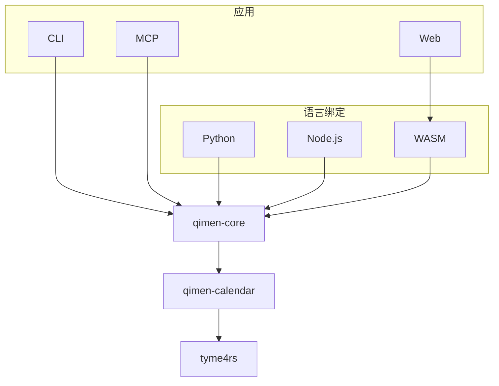

# qimen-rs

[](https://crates.io/crates/qimen-core)
[](https://pypi.org/project/qimen-rs/)
[](https://www.npmjs.com/package/@spensercai/qimen-rs)
[](https://www.npmjs.com/package/@spensercai/qimen-wasm)

[](https://github.com/SpenserCai/qimen-rs/actions/workflows/ci.yml)
[](https://docs.rs/qimen-core/latest/qimen_core/)
[](LICENSE)

[English](README.en.md) · [在线排盘](https://qimen-rs.vercel.app) · [安装](docs/installation.md) · [使用指南](docs/usage.md) · [算法约定](docs/algorithm-sources.md) · [扩展参数](#可选扩展)

以 Rust 实现的八字与奇门遁甲排盘库。输入公历年月日时分秒，得到具有明确历法和流派约定的结构化结果。默认采用 **时家奇门、拆补法、转盘、中五寄坤、天禽随芮**。

计算可完全离线运行。Rust、Python、Node.js、WebAssembly、Web、CLI 和 MCP 共享同一套排盘规则与结果格式。

- **历法与八字**：农历、四柱、节气交接时刻、可配置的换日规则。
- **完整基础盘**：阴阳遁、三元局数、旬首、值符值使、九宫盘层、旬空与时马。
- **可选注记**：暗干、旺衰、十二长生、六仪击刑、入墓、日马与门迫，按需开启。
- **多种接入方式**：Rust 类型、JSON、Python 字典、JavaScript 对象、终端与 MCP 工具。
- **可视化排盘**：星垣深空与宋体中文界面、九宫详情、按时辰切换、分享与导出，支持桌面和手机。

本文对应 **0.2.0 接口**。Streamable HTTP 和扩展日期范围要求 **0.2.0+**；使用前请确认安装版本，也可从源码构建。Rust crate 和各语言包使用统一项目版本，JSON Schema 版本单独表示数据结构的兼容性。

## 安装与快速开始

从 [GitHub Releases](https://github.com/SpenserCai/qimen-rs/releases) 下载适合当前系统的压缩包，解压即可使用 `qimen` 和 `qimen-mcp`。也可通过 Cargo 安装正式版：

```bash
cargo install qimen-cli --locked
cargo install qimen-mcp --locked
```

```bash
qimen paipan --year 2026 --month 9 --day 18 --hour 15
qimen paipan --year 2026 --month 9 --day 18 --hour 15 --json
qimen bazi --year 2026 --month 9 --day 18 --hour 15
```

分钟和秒默认为 0，UTC 偏移默认为 +480 分钟（UTC+08:00），默认 23:00 子初换日。输入是指定偏移下的民用时间，不读取机器时区。

| 接入方式 | 安装 | 文档 |
| --- | --- | --- |
| Rust | `cargo add qimen-core` | [Rust API](https://docs.rs/qimen-core/latest/qimen_core/) |
| Python 3.10+ | `python -m pip install qimen-rs` | [Python 用法](bindings/python/README.md) |
| Node.js 20+ | `npm install @spensercai/qimen-rs` | [Node.js / TypeScript 用法](bindings/node/README.md) |
| 浏览器 WASM | `npm install @spensercai/qimen-wasm` | [WebAssembly 用法](bindings/wasm/README.md) |

预构建产物覆盖 Linux x64 / arm64、macOS x64 / arm64、Windows x64；系统要求和源码安装见[安装指南](docs/installation.md)。

### Web 排盘

[打开在线排盘](https://qimen-rs.vercel.app)，无需安装。输入公历时间与 UTC 偏移，短暂的罗盘动效结束后显示八字和九宫盘；选择宫位可展开天盘、地盘、九星、八门、八神和扩展注记。计算由浏览器内的 WASM 完成。桌面三栏随窗口高度自适应，较长的宫位详情在栏内滚动；窄屏按顺序排列。

使用 Node.js 22+ 在本地启动：

```bash
cd apps/web
npm ci
npm run dev
```

打开 [localhost:3000](http://localhost:3000)。完整操作说明见 [Web 使用指南](apps/web/README.md)。

### Rust

```rust
use qimen_core::{ChartRequest, calculate};

fn main() -> Result<(), qimen_core::Error> {
    let chart = calculate(&ChartRequest::new(2026, 9, 18, 15))?;
    println!("{}{}局", chart.dun, chart.ju);
    println!("{:?}", chart.calendar.four_pillars);
    Ok(())
}
```

### Python

```python
from qimen_rs import calculate

chart = calculate({"year": 2026, "month": 9, "day": 18, "hour": 18})
print(chart["calendar"]["four_pillars"])
print(chart["palaces"])
```

### Node.js

```javascript
const { calculate } = require('@spensercai/qimen-rs');

const chart = calculate({ year: 2026, month: 9, day: 18, hour: 18 });
console.log(chart.calendar.four_pillars);
console.log(chart.palaces);
```

也支持 ESM：`import { calculate } from '@spensercai/qimen-rs'`。浏览器使用独立的 [WASM 包](bindings/wasm/README.md)，初始化后调用相同的计算接口。

### JSON

Python、JavaScript、MCP 的排盘工具和 Rust `calculate_json` 使用相同的请求字段：

```json
{
  "year": 2026,
  "month": 9,
  "day": 18,
  "hour": 15,
  "minute": 0,
  "second": 0,
  "utc_offset_minutes": 480,
  "day_boundary": "zi_start"
}
```

未知字段、无效日期和不支持的参数会显式报错。详细字段见[使用指南](docs/usage.md)、[输入 Schema](docs/schema/request.schema.json)、[结果 Schema](docs/schema/chart.schema.json) 和[完整输出示例](docs/examples/2026-09-18T150000+0800.json)。

### 可选扩展

扩展默认全部关闭。JSON、Python、Node.js、WASM 和 MCP `paipan` 请求共用 `extensions` 对象：**key 选择注记，value 选择计算规则**，不是布尔开关。

| `extensions` key | 可选 value | 含义 |
| --- | --- | --- |
| `hidden_stems` | `duty_door_hour_stem_with_center_fallback` | 暗干：值使宫起时干，重本位地盘干时改从中五起；甲时先替换为旬首遁干 |
| `strength` | `classical_stars_and_five_elements` | 旺衰：九星用烟波法，门、干用一般五行法；分别评价落宫与节气月令 |
| `growth_stages` | `yang_forward_yin_reverse_fire_earth` | 十二长生：阳顺阴逆、土随火；每个宫支分别返回 |
| `punishments` | `six_instrument_branches` | 六仪击刑：按六仪对应的刑支判断，保留盘层与寄干身份 |
| `tombs` | `growth_stage_fire_earth` | 十干按十二长生墓支判断，乙墓在戌；全开预设选用此规则 |
| `tombs` | `traditional_three_wonders` | 古典三奇入墓：乙未、丙戌、丁丑；六仪不适用 |
| `day_horse` | `day_branch_three_harmony` | 日马：按已计算日柱的日支三合取马，不改变基础盘时马 |
| `door_pressure` | `door_controls_palace` | 门迫：门五行克落宫五行；宫克门不算门迫 |

只传需要的 key；省略或设为 `null` 即关闭该项。`tombs` 的两个值二选一，不能同时使用。基础 `bazi` 工具不接受扩展。

```json
{
  "year": 2026,
  "month": 9,
  "day": 18,
  "hour": 18,
  "extensions": {
    "day_horse": "day_branch_three_harmony",
    "tombs": "traditional_three_wonders"
  }
}
```

Rust 可在初始化计算器时选择规则，也可通过 `calculate_with_options` 为单次计算传参：

```rust
use qimen_core::{Calculator, ChartRequest, DayHorseRule, ExtensionOptions};

fn main() -> Result<(), qimen_core::Error> {
    let calculator = Calculator::new(ExtensionOptions {
        day_horse: Some(DayHorseRule::DayBranchThreeHarmony),
        ..Default::default()
    });
    let chart = calculator.calculate(&ChartRequest::new(2026, 9, 18, 18))?;
    println!("{:?}", chart.extensions);
    Ok(())
}
```

`ExtensionOptions::all()` 开启所有已实现扩展。CLI 通过参数选择：

```bash
qimen paipan --year 2026 --month 9 --day 18 --hour 18 --extensions all
qimen paipan --year 2026 --month 9 --day 18 --hour 18 \
  --extensions hidden-stems,day-horse --json
```

扩展结果写入 `chart.extensions`，保留规则名、盘层与寄干身份，不改变基础盘或时马；未启用时省略该字段。CLI 使用连字符名称，例如 `day-horse`；入墓另选规则时使用 `--extensions tombs --tomb-rule traditional-three-wonders`。完整的 [CLI / Rust 参数映射](docs/extensions.md#各接口参数对照)、[结果字段](docs/extensions.md#结果字段速查)和[枚举值含义](docs/extensions.md#结果枚举值)见扩展文档。规则的流派差异与公式也在该文档中说明。

### MCP

启动 `qimen-mcp` 即提供 stdio 服务，工具包括 `bazi` 和 `paipan`。客户端配置示例：

```json
{
  "mcpServers": {
    "qimen": {
      "command": "/absolute/path/to/qimen-mcp",
      "args": []
    }
  }
}
```

**0.2.0+** 支持 Streamable HTTP，可运行 `qimen-mcp --transport streamable-http`，连接 `http://127.0.0.1:8080/mcp`。

将 `command` 替换为本机可执行文件的绝对路径。协议由官方 rmcp SDK 处理，支持 2026-07-28 及兼容的旧版生命周期；调用参数、返回值和连接方式见 [MCP 使用指南](docs/usage.md#mcp)。

## 时间与流派约定

| 项目 | 约定 |
| --- | --- |
| 输入范围 | 0.1.0：公历 1900–2100 年；0.2.0+：公元 1–9999 年的前推格里高利历 |
| 时区 | 固定 UTC 偏移，默认 UTC+08:00；包含当地适用的夏令时偏移 |
| 年柱 | 按立春交节时刻切换，不按春节或 1 月 1 日 |
| 月柱 | 按十二个“节”的交节时刻切换，不按公历月或农历月 |
| 日柱 | `zi_start`：23:00 换日；`midnight`：00:00 换日 |
| 晚子时 | `midnight` 下 23 点日柱属当天，时干按次日子时，整段子时连续 |
| 日时计算 | 使用输入地的民用时间，不自动进行真太阳时修正 |
| 阴阳遁 | 冬至起阳遁，夏至起阴遁，按交节时刻切换 |
| 三元与局数 | 甲己符头定上中下元，按当前节气取拆补局数 |
| 中五与天禽 | 中五固定寄坤二，天禽随天芮，原始中宫信息保留 |
| 空亡、马星 | 基础盘使用时旬空与时马；日马由扩展独立提供 |

同一绝对时刻的年、月柱不随输入 UTC 偏移改变；日时柱按输入的本地民用时间计算。节气时间精确到秒表示输出分辨率，不等于所有年代均具有一秒的天文精度。

0.2.0+ 的历史日期统一使用前推格里高利历，相邻节气在输入边界可能跨至 0 或 10000 年，年初的农历年份也可能为 0。远古和远期的可计算范围不表示现代天文精度，详见[时间范围说明](docs/usage.md#历史日期与远期日期)。

置闰、茅山、飞盘及其他寄宫方案尚未实现。跨软件比较时，先统一时间、换日、定局和寄宫约定。完整公式见[算法说明](docs/algorithm-sources.md)。

## 结果与结构

结果包含输入与计算约定、农历与四柱、当前和下一节气、阴阳遁与三元局数、旬首与遁干、值符值使，以及洛书九宫的方向、八卦、五行、地盘干、天盘干、寄干、九星、八门、八神、空亡与马星。中宫和天禽的寄宫关系显式表达。



箭头表示调用依赖。`qimen-core` 提供排盘与可选注记，`qimen-calendar` 提供历法与四柱；应用和绑定共享结果。吉凶判断与预测解释不属于基础排盘数据。

## 许可

[MIT](LICENSE)。历法依赖及参考资料保留各自许可，来源见[算法说明](docs/algorithm-sources.md)。
