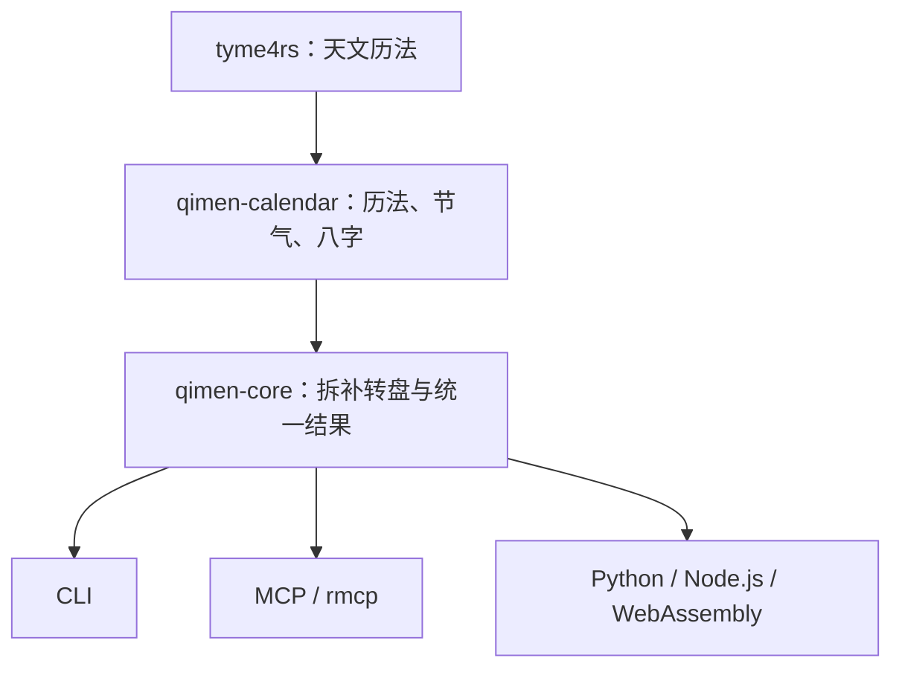

# qimen-rs

[English](README.en.md) · [算法与资料](docs/algorithm-sources.md) · [维护指南](AGENTS.md) · [发布指南](docs/releasing.md)

以 Rust 实现的八字与奇门遁甲排盘库。输入公历年月日时分秒，得到具有明确历法和流派约定的结构化结果。默认采用 **时家奇门、拆补法、转盘、中五寄坤、天禽随芮**。

核心库不依赖网络、运行时或应用框架；Python、Node.js、WebAssembly、CLI 和 MCP 共享同一套计算逻辑。

## 架构



| 目录 | 职责 |
| --- | --- |
| `crates/qimen-calendar` | 校验公历输入，计算节气、农历和四柱，隔离历法依赖 |
| `crates/qimen-core` | 定局、布盘、统一结果与 JSON API |
| `bindings/python` | PyO3 + maturin，Python 字典与 JSON 接口 |
| `bindings/node` | napi-rs，Node.js 对象接口与 TypeScript 类型 |
| `bindings/wasm` | wasm-bindgen，浏览器与其他 WASM 宿主 |
| `apps/qimen-cli` | 终端九宫盘、八字、JSON 输出 |
| `apps/qimen-mcp` | 官方 rmcp SDK 的 stdio MCP 服务 |

依赖方向始终从应用、绑定指向核心。新流派应在核心增加独立策略及可核验测试，不在各语言或应用中重新实现算法。

## 快速开始

需要 Rust stable（edition 2024）。尚未发布到各注册表时，请从源码构建：

```bash
git clone https://github.com/SpenserCai/qimen-rs.git
cd qimen-rs
cargo run -p qimen-cli -- paipan --year 2026 --month 9 --day 18 --hour 15
cargo run -p qimen-cli -- paipan --year 2026 --month 9 --day 18 --hour 15 --json
cargo run -p qimen-cli -- bazi --year 2026 --month 9 --day 18 --hour 15
```

分钟和秒默认为 0，固定 UTC 偏移默认 +480 分钟（UTC+08:00），默认 23:00 子初换日。应用不猜测操作系统时区。

### Rust

```rust
use qimen_core::{ChartRequest, calculate};

let request = ChartRequest::new(2026, 9, 18, 15);
let chart = calculate(&request)?;
println!("{}", serde_json::to_string_pretty(&chart)?);
# Ok::<(), Box<dyn std::error::Error>>(())
```

正式接口契约：[输入 Schema](docs/schema/request.schema.json)、[完整排盘 Schema](docs/schema/chart.schema.json)、[完整输出示例](docs/examples/2026-09-18T150000+0800.json)。

JSON 入口也接受同样的请求：

```json
{"year":2026,"month":9,"day":18,"hour":15,"minute":0,"second":0,"utc_offset_minutes":480,"day_boundary":"zi_start"}
```

未知字段、无效日期和不支持的参数应显式报错，不能悄悄回退到另一种排盘口径。结果携带 schema 版本；调用者不应依赖 JSON 属性的排列顺序。

### 可选扩展

暗干、旺衰、十二长生、六仪击刑、入墓、日马及门迫均由核心统一计算，**默认关闭**。它们是常见辅助规则，但流派之间并非只有一种算法；适用范围、公式和出处见 [扩展规则](docs/extensions.md)。

Rust 可以在计算器初始化时选择规则，也可以使用 `calculate_with_options` 为单次计算传参：

```rust
use qimen_core::{Calculator, ChartRequest, DayHorseRule, ExtensionOptions};

let calculator = Calculator::new(ExtensionOptions {
    day_horse: Some(DayHorseRule::DayBranchThreeHarmony),
    ..Default::default()
});
let chart = calculator.calculate(&ChartRequest::new(2026, 9, 18, 18))?;
assert!(chart.extensions.is_some());
# Ok::<(), qimen_core::Error>(())
```

`ExtensionOptions::all()` 显式启用所有已实现扩展；入墓默认采用阴阳顺逆、土随火的十二长生墓位，另可选择仅适用于乙丙丁的古典三奇入墓规则。

```bash
cargo run -p qimen-cli -- paipan --year 2026 --month 9 --day 18 --hour 18 --minute 15 --extensions all
cargo run -p qimen-cli -- paipan --year 2026 --month 9 --day 18 --hour 18 --extensions day-horse,hidden-stems --json
```

MCP 的 `paipan` 与 Python、Node.js、WASM 请求使用相同的 `extensions` 参数：

```json
{"year":2026,"month":9,"day":18,"hour":18,"minute":15,"extensions":{"day_horse":"day_branch_three_harmony","hidden_stems":"duty_door_hour_stem_with_center_fallback"}}
```

扩展结果写入 `chart.extensions` 并携带选用规则，不改变四柱、基础九宫或时马；未启用时不输出该字段。`bazi` 仅处理历法，不接受奇门扩展。Schema **1.1** 在 1.0 基础上增加此可选输入/输出，原有日期请求仍然有效，Rust 仍可读取不含扩展的 1.0 结果。

### Python / Node.js / WebAssembly

绑定提供原生对象和 JSON 两种接口。安装、构建和语言示例见各目录：

- [Python](bindings/python/README.md)
- [Node.js / TypeScript](bindings/node/README.md)
- [WebAssembly](bindings/wasm/README.md)

### MCP

```bash
cargo build --release -p qimen-mcp
./target/release/qimen-mcp
```

客户端 stdio 配置示例，`command` 替换为本机可执行文件的绝对路径：

```json
{"mcpServers":{"qimen":{"command":"/absolute/path/to/qimen-mcp","args":[]}}}
```

工具提供八字和完整排盘。rmcp 的 **2026-07-28 新生命周期**与旧版 `initialize` 生命周期由 SDK 处理；协议兼容通过集成测试验证。stdio 标准输出专用于协议消息，诊断信息使用标准错误。

## 时间与流派约定

| 项目 | 本版本约定 |
| --- | --- |
| 输入范围 | 公历 1900–2100 年；无效日期、时分秒与偏移报错 |
| 时区 | 显式固定 UTC 偏移；默认 UTC+08:00。不隐式应用夏令时 |
| 年柱 | 按立春交节时刻切换，不按春节或 1 月 1 日 |
| 月柱 | 按十二个“节”的交节时刻切换，不按公历月或农历月 |
| 日柱 | 默认 `zi_start`：23:00 换日；可选 `midnight`：00:00 换日 |
| 晚子时 | `midnight` 下 23 点日柱仍属当天，时干按次日子时；整段子时连续 |
| 节气 | 按天文历法交节时刻比较；同一绝对时刻的年、月柱不随输入偏移改变 |
| 日时计算 | 按输入地的民用时间；不自动进行真太阳时修正 |
| 阴阳遁 | 冬至起阳遁，夏至起阴遁，按交节时刻切换 |
| 三元与局数 | 甲己符头定上中下元，按当前节气取拆补局数 |
| 中五 | 固定寄坤二；原始中宫信息仍保留，天禽随天芮 |
| 值使 | 先从旬首原始宫位飞九宫，再处理落中寄宫 |
| 旬空、驿马 | 以时柱为奇门盘标记依据，并保留四柱信息 |

这些约定是计算契约。不同软件可能采用置闰、茅山、飞盘、阳艮阴坤、真太阳时或其他晚子时规则，应先对齐设置再比较。当前不声称已经支持这些其他流派。

精确到秒的字段表示算法输出分辨率，不是与所有天文年历绝对一致到一秒的保证；紧贴交节时刻的案例应同时记录历法版本和交节结果。

## 排盘结果

统一结果包括：

- 输入、公历与农历信息、四柱干支、当前和下一节气及交节时刻。
- 流派约定、阴阳遁、局数、上中下元、符头、时旬首与遁干。
- 值符星、值使门，以及其原始宫位和实际落宫。
- 洛书九宫、方位、八卦、五行、地盘三奇六仪、天盘干和寄干、九星、八门、八神。
- 时旬空亡与时驿马标记；中宫和天禽的寄宫关系显式表达。

机器接口的枚举与字段稳定、可序列化；中文展示由应用负责。暂不把吉凶判断、预测解释混入基础排盘数据。

## 验证与维护

项目质量门禁包括格式检查、零警告 Clippy、构建、测试和文档检查；跨 Linux、macOS、Windows 验证。测试使用独立文件：公开行为测试放 `tests/`，需要私有访问的单元测试使用独立测试模块。Rust 官方也允许内联单元测试，本项目选择分离是为了保持实现文件简洁。

测试区分历法基准、手工推导案例、结构不变量与协议/绑定集成。结构不变量通过不等于整个排盘已经得到独立外部验证。算法来源与现有验证边界见 [算法与资料](docs/algorithm-sources.md) 和 [验证记录及复现方式](docs/validation.md)。

与排盘软件对照时，请提供输入年月日时分秒、UTC 偏移、换日/真太阳时/寄宫设置和完整九宫盘。经确认的案例应作为回归 fixture 加入仓库。

发布流程已与日常 CI 分开；配置注册表凭据并按 [发布指南](docs/releasing.md) 操作后才发布。此仓库首次实现不自动占用 crates.io、PyPI 或 npm 的包名。

## 许可

[MIT](LICENSE)。历法依赖及参考项目保留各自许可；算法研究来源在文档中列明，不将不兼容许可的参考实现复制入本项目。
